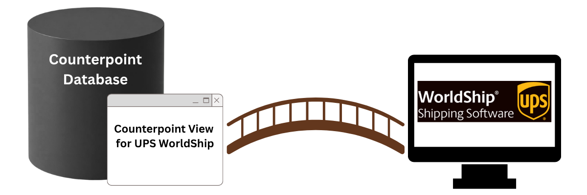
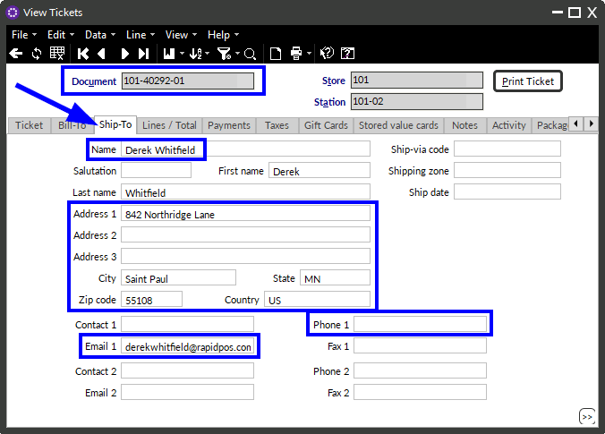

# Rapid POS UPS WorldShip ODBC Support
Updated 10/1/2026

---

Rapid provides support for the UPS WorldShip shipping software (desktop app) to send data from Counterpoint to UPS WorldShip, allowing for faster creation of shipping labels. The connection provides information from **order release tickets** that include a ship-to address. Data moves in one direction only, from Counterpoint to UPS WorldShip.

---

## Minimum System Requirements:
- Minimum Counterpoint version: **8.5.6.2**
- Minimum SQL Server version: **2016**
- Minimum Supported Operating System version: **Windows Server 2016** or **Windows 11 Pro**
- Counterpoint must be installed on the same workstation as the UPS WorldShip shipping software (desktop app)

If you would like the UPS WorldShip ODBC connection but your system does not meet these minimum requirements, please consult your Care Team Lead (vCIO) for an upgrade quote.

---

## Table of Contents
- [Minimum System Requirements](#minimum-system-requirements)
- [Section 1: Overview of the information provided to UPS WorldShip by the ODBC connection](#section-1-overview-of-the-information-provided-to-ups-worldship-by-the-odbc-connection)
- [Section 2: Looking up release tickets in UPS WorldShip](#section-2-looking-up-release-tickets-in-ups-worldship)
- [Section 3: Mapping of specific fields sent to UPS WorldShip for release tickets](#section-3-mapping-of-specific-fields-sent-to-ups-worldship-for-release-tickets)
- [Section 4: Information not included in the ODBC connection](#section-4-information-not-included-in-the-odbc-connection)
- [Section 5: Special Note on State/Province Abbreviations](#section-5-special-note-on-stateprovince-abbreviations)
- [Section 6: Special Note on Country Codes](#section-6-special-note-on-country-codes)
- [Conclusion](#conclusion)

---

## SECTION 1: Overview of the information provided to UPS WorldShip by the ODBC connection

A custom view in the Counterpoint database makes information from **order release tickets with a ship-to address** available to UPS WorldShip.

A custom view is a saved, filtered list that Rapid creates in the Counterpoint database. It does not give UPS WorldShip access to all Counterpoint data. Instead, it:
- Includes only unposted order release tickets that have a ship-to address
- Includes only the fields listed in [SECTION 3](#section-3-mapping-of-specific-fields-sent-to-ups-worldship-for-release-tickets)

The view does not store a separate copy of the data. It reads directly from Counterpoint, so a new release ticket is available to UPS WorldShip as soon as it is created.

ODBC stands for Open Database Connectivity. It is a standard Windows tool that works like a bridge between a program and a database. In this setup, UPS WorldShip uses an ODBC connection to read the custom view. The shipper can work in UPS WorldShip and look up a release ticket without opening Counterpoint or copying information between the two systems.

UPS WorldShip uses a 32-bit ODBC connection. The data source must be created in the 32-bit ODBC Data Source Administrator in Windows, or UPS WorldShip will not see it.

The following software is required on the UPS WorldShip PC:
- Counterpoint, which must be installed on the same workstation as the UPS WorldShip shipping software (desktop app)
- The Microsoft SQL Server ODBC driver, so that the UPS WorldShip PC can communicate with Microsoft SQL Server
- The UPS WorldShip shipping software (desktop app), which the client will download from UPS

### Order Release Tickets

- When an order (or part of an order) is released in Counterpoint, a release ticket is created.
- Only order release tickets that contain a ship-to address are provided to UPS WorldShip.
- Only **unposted release tickets** are available. After a release ticket is posted, it can no longer be found in UPS WorldShip.
- Orders and regular tickets are not sent to UPS WorldShip.

---

## SECTION 2: Looking up release tickets in UPS WorldShip

1. In UPS WorldShip, the shipper enters or scans the release ticket number.
2. UPS WorldShip finds the matching release ticket and fills in the shipment details.
3. The shipper confirms the package details, such as weight and service, and processes the shipment.

The ticket number is the lookup key. Each release ticket has its own number, made up of the order number and a sequence number. For example, an order shipped in three parts has release tickets 1234-01, 1234-02, and 1234-03.

---

## SECTION 3: Mapping of specific fields sent to UPS WorldShip for release tickets

### Release Ticket Header Fields

| Counterpoint Field | UPS WorldShip Section | UPS WorldShip Field | Notes |
|---|---|---|---|
| Document ID | Shipment Information | Unique Shipment Identifier | Accepts letters and numbers. |
| Ticket Number | Shipment Information | Reference 1 | Accepts letters, numbers, and special characters. |
| Ship-To Email Address 1 | Shipment Information | Recipient Email Address | Must pass the [UPS email address validation](https://www.ups.com/worldshiphelp/WSA/ENU/AppHelp/mergedProjects/CORE/TASKS/Validate_Email_Addresses.htm). |
| Ship-To Customer Number | Ship To | Customer ID | Must be unique. Accepts letters, numbers, and special characters. |
| Ship-To Name | Ship To | Company or Name | Accepts letters, numbers, and special characters. |
| Ship-To Address 1 | Ship To | Address 1 | Accepts letters, numbers, and special characters. |
| Ship-To Address 2 | Ship To | Address 2 | Accepts letters, numbers, and special characters. |
| Ship-To Address 3 | Ship To | Address 3 | Accepts letters, numbers, and special characters. |
| Ship-To Country | Ship To | Country/Territory | Must be a two-letter [country code](#section-6-special-note-on-country-codes). |
| Ship-To Zip Code | Ship To | Postcode | Accepts letters and numbers. Limited to 9 characters. |
| Ship-To City | Ship To | City or Town | Accepts letters, numbers, and special characters. |
| Ship-To State/Province | Ship To | State/Province/County | Must be a two-letter [state or province code](#section-5-special-note-on-stateprovince-abbreviations). |
| Ship-To Phone 1 | Ship To | Telephone | Accepts letters, numbers, and special characters. |
| Ship-To Email Address 1 | Ship To | Email Address | Must pass the [UPS email address validation](https://www.ups.com/worldshiphelp/WSA/ENU/AppHelp/mergedProjects/CORE/TASKS/Validate_Email_Addresses.htm). |

NOTE: Ship-To Email Address 1 is intentionally mapped to two UPS WorldShip fields. This mapping can be adjusted by request.

---

## SECTION 4: Information not included in the ODBC connection

- No release ticket line (item) data is provided to UPS WorldShip.
- No data is written back to Counterpoint. This includes tracking numbers and shipping charges.
- Ship From (sender) information is not sent from Counterpoint. It is set up in UPS WorldShip.

---

## SECTION 5: Special Note on State/Province Abbreviations

UPS WorldShip requires all state and province abbreviations to be formatted as valid two-letter codes.

You can review the current state and province code list in the UPS WorldShip documentation:
https://www.ups.com/worldshiphelp/WSA/ENU/AppHelp/mergedProjects/CORE/Codes/State_Province_Codes.htm

Enter the ship-to state or province on the release ticket in Counterpoint as a two-letter code, such as KS or MO. Do not use full state names, such as Kansas or Missouri, as these are not valid in UPS WorldShip.

---

## SECTION 6: Special Note on Country Codes

UPS WorldShip requires all country codes to be formatted as valid two-letter ISO country codes.

You can review the current ISO country code list in the UPS WorldShip documentation:
https://www.ups.com/worldshiphelp/WSA/ENU/AppHelp/mergedProjects/CORE/Codes/Country_Territory_and_Currency_Codes.htm

Enter the ship-to country on the release ticket in Counterpoint as a two-letter code, such as US or CA. Do not use three-letter codes, such as USA or CAN, as these are not valid in UPS WorldShip.

---

## Conclusion

The UPS WorldShip ODBC connection streamlines the transfer of order shipping information from release tickets to UPS WorldShip. This reduces manual entry and helps shipments move efficiently.

If you have questions about setup, troubleshooting, or advanced options, please contact Rapid Support.
